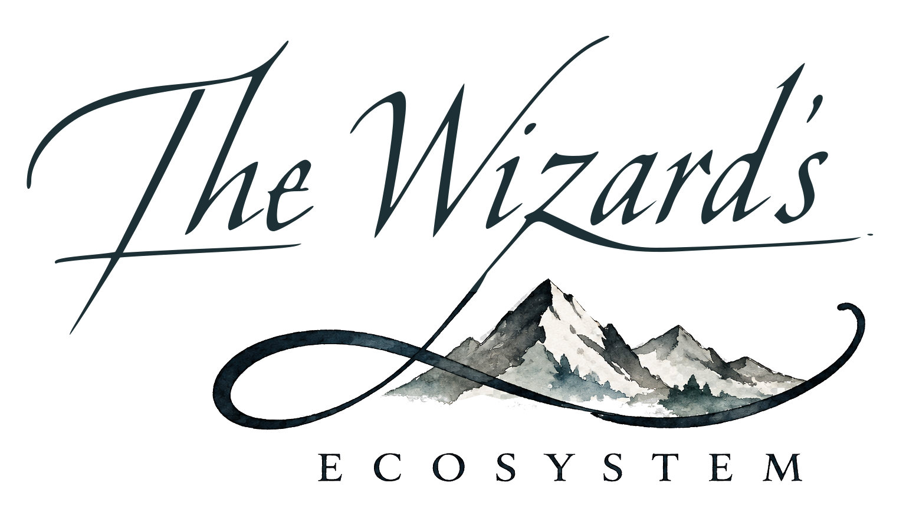

<h1>
  <picture>
    <source media="(prefers-color-scheme: dark)" srcset="brand/ecosystem/ecosystem-logo-dark.svg">
    
  </picture>
</h1>

`.github`, organization defaults.

This repository is **public** and does two jobs.

## 1. The organization profile

[`profile/README.md`](profile/README.md) renders at
[github.com/wizards-ecosystem](https://github.com/wizards-ecosystem) for everyone.

The member-only counterpart lives in the separate **private** `.github-private`
repository, at the same `profile/README.md` path. Organization members see that one;
everyone else sees this one. Keep the public page honest and the private page useful.
They are two different documents, not two versions of one.

## 2. Organization-wide defaults

GitHub falls back to the files here for any repository in the organization that does not
have its own. A repository's own copy always wins.

Overrides as of 2026-09-06. A repository absent from a row inherits this repository's
copy of that file.

| File | Overridden today by |
| --- | --- |
| [`CODE_OF_CONDUCT.md`](CODE_OF_CONDUCT.md) | Lyre, Brush |
| [`CONTRIBUTING.md`](CONTRIBUTING.md) | Wizzy, Lyre, Brush, Pick, Herald |
| [`SECURITY.md`](SECURITY.md) | Wizzy, Lyre, Brush, Pick, Familiar, Herald |
| [`SUPPORT.md`](SUPPORT.md) | Wizzy, Lyre, Brush, Herald |
| [`.github/ISSUE_TEMPLATE/`](.github/ISSUE_TEMPLATE/) | Lyre, Brush, Pick, Conclave, Herald |
| [`.github/PULL_REQUEST_TEMPLATE.md`](.github/PULL_REQUEST_TEMPLATE.md) | Wizzy, Lyre, Brush, Pick, Conclave, Herald |

The OS, Courier, Charter, and Press override nothing and inherit all six. Conclave has
its own templates but no `CONTRIBUTING.md`, `SECURITY.md`, or `SUPPORT.md`.

## Also here

[**`BRAND.md`**](BRAND.md) holds the naming model, visual direction, voice, and status
vocabulary. The production artwork, semantic tokens, usage rules, provenance, and pinned
build live in [**`brand/`**](brand/). Together they are the authority; where a repository
disagrees, the repository is out of date.

The local 500 x 500 organization-avatar export is
[`brand/ecosystem/ecosystem-avatar.png`](brand/ecosystem/ecosystem-avatar.png). Creating
the file does not upload it to GitHub; that remains an organization-settings action.
