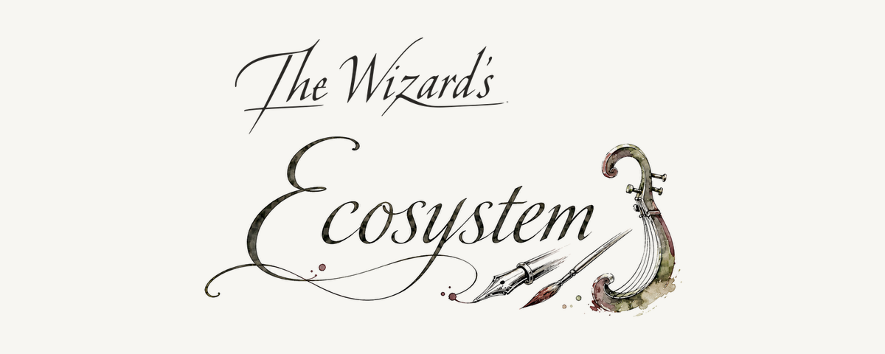

# The Wizard's Ecosystem

**Software that carries its own guarantees and runs on your machine.**

We build local software for programming, media creation, and authorized security
testing. Four projects have public releases. Four are still being developed in private.

## Available now

| Project | What it does | Release |
| --- | --- | --- |
| [**The Wizard's Lyre**](https://github.com/wizards-ecosystem/wizards-lyre) | A generative music studio powered by ACE-Step 1.5. Generation runs on your own GPU and each song keeps its plan and take history. | [0.1.0](https://github.com/wizards-ecosystem/wizards-lyre/releases/tag/v0.1.0) |
| [**The Wizard's Brush**](https://github.com/wizards-ecosystem/wizards-brush) | An image and video studio with editing tools, durable queues, and a searchable asset library. It supports local GPUs and remote GPUs you operate. | [0.1.1](https://github.com/wizards-ecosystem/wizards-brush/releases/tag/v0.1.1) |
| [**The Wizard's Pick**](https://github.com/wizards-ecosystem/wizards-pick) | A terminal assistant for authorized security testing. It uses a local model by default and keeps its sessions and reports in SQLite. | [0.2.0](https://github.com/wizards-ecosystem/wizards-pick/releases/tag/v0.2.0) |
| [**The Wizard's Familiar**](https://github.com/wizards-ecosystem/wizards-familiar) | A coding agent that runs entirely on your machine. One standard-library Python file, no dependencies, and a model served locally by llama.cpp. | [0.1.0](https://github.com/wizards-ecosystem/wizards-familiar/releases/tag/v0.1.0) |

Lyre and Brush target Linux x86-64, including Windows 11 through WSL2, and require an
NVIDIA GPU. Pick's bundled local-model setup also targets Linux and WSL2. Familiar is the
exception: it targets macOS on Apple Silicon and needs about 21 GB of disk for its model.
Each repository documents its exact hardware, installation, and security requirements.

## In development

| Project | Current state |
| --- | --- |
| **The Wizard's Ink** | Home of **Wizzy**, an experimental statically typed language. The compiler and toolchain are working, pre-0.1, and private. |
| **The Wizard's OS** | A from-scratch Rust operating system for x86-64 and UEFI. Kernel development is active; the repository is private. |
| **The Wizard's Conclave** | A local coding-agent orchestrator. Its working v0.1 is frozen while the next implementation waits for Wizzy; the repository is private. |
| **The Wizard's Courier** | A durable job service for the studios. The protocol, specification, and conformance corpus are written. Implementation waits for Wizzy's process, socket, and JSON support; the repository is private. |

## How the projects connect

Wizzy is planned for the OS userland, the next Conclave, and Courier. Lyre and Brush have
their own job queues today and are intended to use Courier once it exists. None of the
public releases depends on those unfinished pieces. Familiar shares nothing with the rest and
needs nothing from it; it is one file and a local model.
